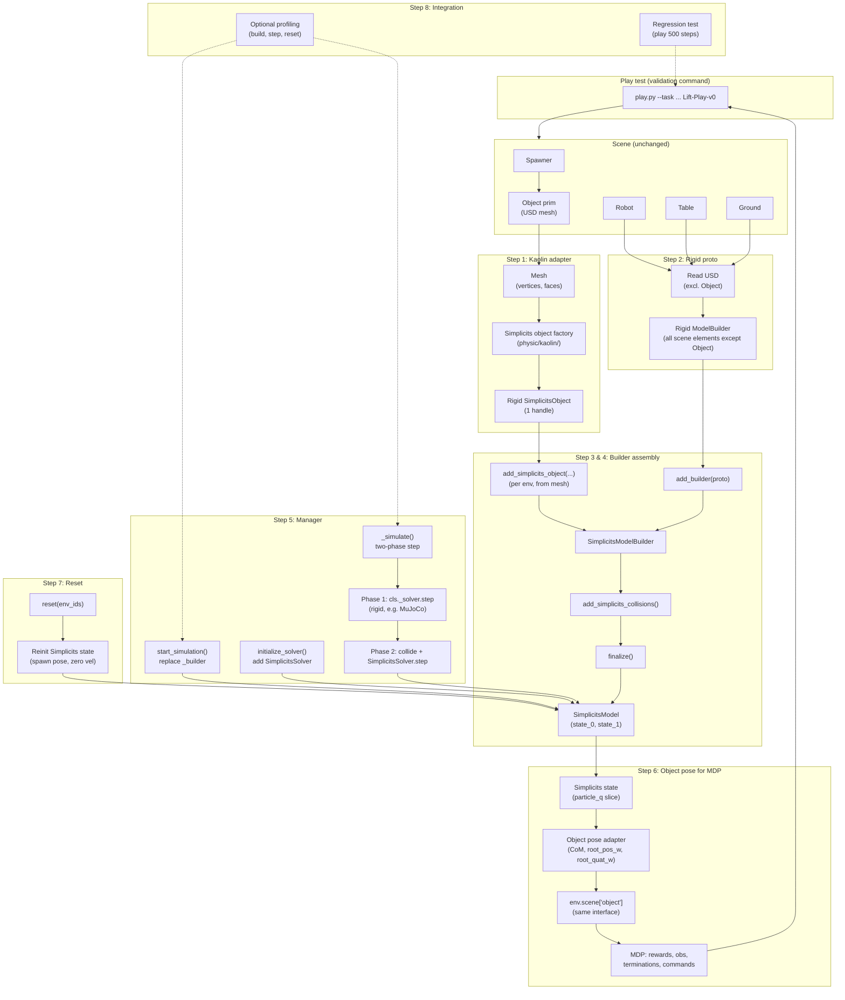
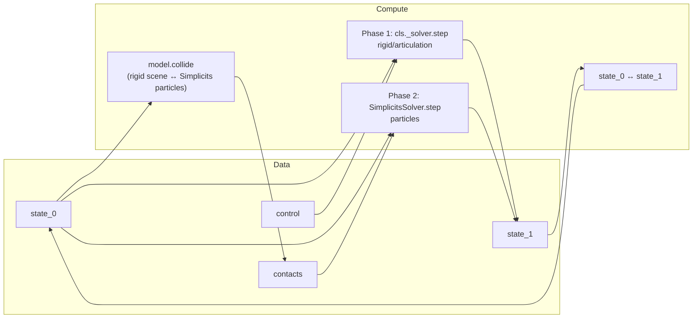
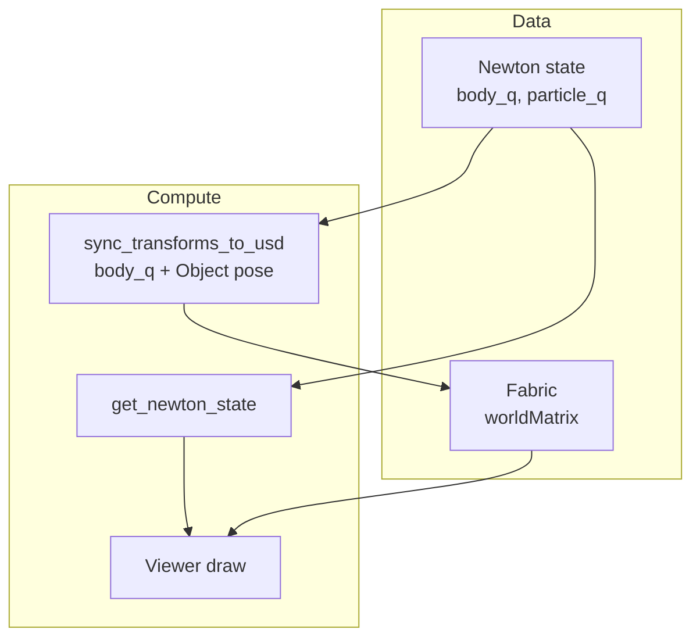
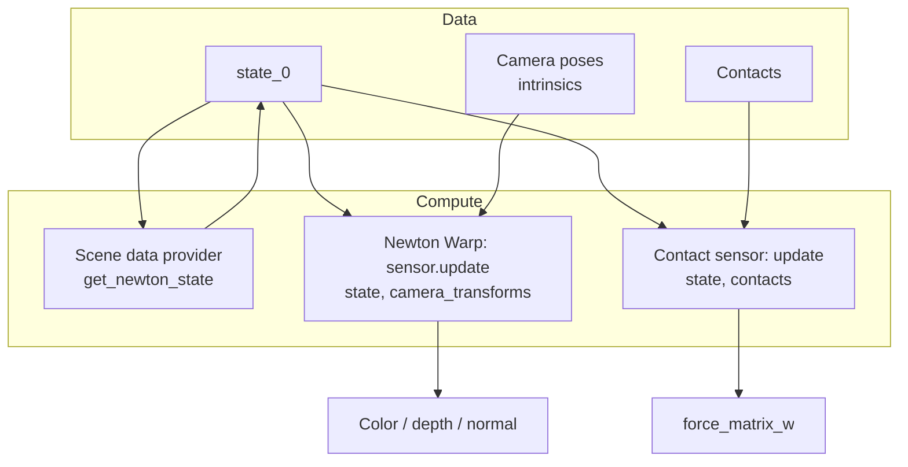

# Simplicits Spawn Object Integration Plan (Isaac–Dexsuite-3dg–Kuka–Allegro)

**Goal:** Use a Simplicits (Kaolin) version of the spawn object instead of a rigid body, via the extended Newton manager, keeping all other task scene elements (e.g. robot, table, ground) unchanged and adding all logic from Kaolin's `SimplicitsModelBuilder` and simulation. No code changes outside the task folder; physics code under `config/kuka_allegro/physic` (Newton or Kaolin); minimize/localize Kaolin API surface. If we hit a **blocker** in the Kaolin physics API, we may change it **as minimally as possible** (prefer task-side workarounds first).

**Reference:** `/mnt/dev/isaac-newton2/kaolin/examples/tutorial/physics/example_coupling_newton_franka.py`

**Specifications:**
- Start with **rigid Simplicits (1 handle)** only: use `SimplicitsObject.create_rigid(...)` so the object behaves as a rigid body in the Simplicits formulation (single affine transform; no deformation).
- **MDP compatibility:** Do not change MDP code. A pretrained policy trained with the current (rigid-object) codebase must still work. The object pose adapter must expose the same interface (`root_pos_w`, `root_quat_w`, etc.) so that rewards, observations, terminations, and commands see identical semantics; only the data source (Simplicits state vs rigid body state) changes under the hood.
- **Robot simulation (solver-agnostic):** The robot and all other rigid scene elements (e.g. table, ground) use the **same** simulation as the current NewtonManager. Our implementation must **not** switch to a specific solver (e.g. Featherstone); it must remain **agnostic** and reuse whatever solver is already configured (for this task: MuJoCo via `MJWarpSolverCfg`, to be validated in code). The two-phase step is: (1) run the **existing** rigid/articulation step exactly as the base NewtonManager does (`cls._solver`), (2) run SimplicitsSolver only for the Simplicits particles.

---

## 1. Summary of the reference example

- **SimplicitsModelBuilder** (Kaolin): extends Newton `ModelBuilder`; adds Simplicits objects, simplicits–simplicits collisions, then in `finalize()` registers Simplicits particles with Newton and auto-adds soft–rigid collisions.
- **Build order:** `add_simplicits_object(...)` (one or more) → `add_simplicits_collisions(...)` → `add_builder(robot)` → `add_ground_plane()` → `finalize()`.
- **Simulation in the example:** The Franka example uses two-phase step with (1) `SolverFeatherstone.step(...)` for the robot and (2) `SimplicitsSolver.step(...)` for the soft bodies. **Our implementation is different:** we do **not** use Featherstone or any other specific robot solver. We keep the **same** robot simulation as the current NewtonManager (i.e. whatever solver is configured, e.g. MuJoCo for this task). We only **add** the Simplicits phase for the spawn object particles; the rigid/articulation phase is unchanged (same `cls._solver.step(...)` as in the base NewtonManager).
- **Object creation (rigid):** Mesh → point sample → `SimplicitsObject.create_rigid(pts, yms, prs, rhos, approx_volume)` (effectively 1 handle).

Constraints for us:

- All task scene elements other than the spawn object stay as Newton rigid (no change to their handling; e.g. robot, table, ground).
- Only the **spawn object** becomes Simplicits (rigid, 1 handle) and participates in soft–rigid and soft–soft collision.
- All new code stays under the task folder; Kaolin usage isolated behind clear semantic functions.

---

## 2. Validation command (canonical)

Use the following to validate the implementation against the current rigid-object behavior. Run from the IsaacLab repo root; with simplicits **disabled** this should match current behavior; with simplicits **enabled** the same command should run without error and the policy should still receive compatible observations/actions.

```bash
CUDA_VISIBLE_DEVICES=1 python scripts/reinforcement_learning/rsl_rl/play.py \
  --task Isaac-Dexsuite-3dg-Kuka-Allegro-Lift-Play-v0 \
  --num_envs 1 \
  --visualizer newton \
  presets=cube
```

- Use the project’s usual Python environment (e.g. `./isaaclab.sh -p` or `micromamba run -n env_isaaclab-newton2` when applicable).
- If the project uses `./isaaclab.sh -p` for running Python, use: `./isaaclab.sh -p scripts/reinforcement_learning/rsl_rl/play.py ...` (same args).

### 2.1 play.py always working (intermediate integration)

**Principle:** At the **end of every step**, `play.py` must run **without crash** in at least one supported configuration. Configurations that are not yet implemented must fail with a **clear, actionable error message** (e.g. "Simplicits is not yet available; complete Step 5 or set simplicits_enabled=False") instead of a raw traceback. So we can run and test `play.py` early and often, even in a limited way.

**Supported configurations per step (integration gates):**

| After step | Supported play config | Unsupported → error message |
|------------|------------------------|-----------------------------|
| **1** | Same as today (simplicits off). No code path uses Simplicits yet. | — |
| **2** | Same as today (simplicits off). Helper exists but not wired. | If simplicits_enabled=True: "Simplicits not yet wired; complete Step 5 or set simplicits_enabled=False." |
| **3–4** | Same as Step 2 (play still uses default builder; Simplicits only in tests). | Same as Step 2. |
| **5** | **simplicits off** (unchanged) and **simplicits on** with **num_envs=1**, presets=cube; simulation steps; object as particles. | If simplicits on + num_envs>1: clear message that multi-env Simplicits is limited until Step 7 validated (or allow and test). |
| **6** | Step 5 config + **pretrained policy** runs; observations/actions same shape; object pose from adapter. | — |
| **7** | Step 6 + **multi-episode** (resets); **num_envs≥1** with simplicits on. | — |
| **8** | Full: 500 steps off/on; optional num_envs>1; profiling. | — |

**Implementation:** From Step 2 onward, when the user enables Simplicits (or uses a config that requires Simplicits) before the corresponding feature is implemented, the task or manager should **detect** it and **raise a clear error** (e.g. `RuntimeError` or task-level check with a message pointing to the config or the step to complete). Never leave the user with an opaque crash. After Step 5, the default or a documented "minimal Simplicits" preset (e.g. num_envs=1, newton visualizer) should work so that play.py is always runnable in some configuration.

---

## 3. High-level approach (no changes outside task folder)

- **Builder:** Use **SimplicitsModelBuilder** instead of plain **ModelBuilder** for the Newton scene, with rigid content from USD (all task scene elements except the spawn object, e.g. robot, table, ground) and the object from **rigid Simplicits (1 handle)**. The Simplicits object is created **from the spawned object's mesh** (spawner runs as usual; we read mesh from the spawned prim and convert to Simplicits), keeping the pipeline generic and extensible.
- **Builder injection:** Override **`start_simulation`** in **Dexsuite3dgNewtonManager**: when “simplicits object” mode is enabled, build our own SimplicitsModelBuilder (rigid proto from USD excluding Object + one rigid Simplicits object per env, each created from that env's **spawned object mesh**), then set `cls._builder` so that `super().start_simulation()` finalizes it and sets `cls._model` to a **SimplicitsModel**.
- **Solver:** Override **`_simulate`** (two-phase: **existing** NewtonManager rigid/articulation step unchanged, then **SimplicitsSolver** for particles only) and **`initialize_solver`** (add SimplicitsSolver). The implementation is **solver-agnostic**: the first phase uses whatever `cls._solver` is already configured (e.g. MuJoCo), not a specific solver type.
- **Object state for MDP:** Provide pose from Simplicits state (e.g. CoM of particles) through the **same** `env.scene["object"]` / `RigidObject`-style interface so that **no MDP code changes** and pretrained policies keep working.

**Visualizer and sensors: how they see the Simplicits object**

Newton *does* know about the Simplicits object: after `SimplicitsModelBuilder.finalize()`, the Simplicits particles are registered in the **same** Newton state (`particle_q`, `particle_qd`) and the model has `simplicits_particle_start` / `simplicits_particle_end`. Collision and the SimplicitsSolver use that state. So the physics side is consistent.

**Neither the visualizer nor the sensors read USD each frame** — they use data from the **physics manager (Newton state / contacts)**. The actual behaviour is:

- **Newton OpenGL visualizer:** Does **not** read USD. Each frame it gets **state** from the scene data provider (`get_newton_state()` → `NewtonManager.get_state_0()`). The Newton viewer calls `viewer.log_state(state)` and draws from **state**: bodies from `body_q` and **particles** from `state.particle_q` (when "Show Particles" is enabled; see `newton/_src/viewer/viewer.py` `_log_particles()`). So the Simplicits object is **already visible** as soon as its particles are in `state.particle_q` — **no USD or Fabric sync needed** for this path.

- **Kit / RTX:** When the renderer requires USD (e.g. `kit`, `isaac_rtx`, `ovrtx`), the scene data provider's `update()` runs `NewtonManager.sync_transforms_to_usd()`, which **writes** `state_0.body_q` to Fabric for each prim with a body. The Object has **no** body in the Simplicits path, so for Kit/RTX we must **additionally write** the Object prim world transform to Fabric (from the same Simplicits pose as MDP), only when `_needs_usd_sync` is True. Sensors get data from the physics pipeline (state/contacts), not from USD.

(1) Newton visualizer uses **state** only; Simplicits object shows as particles in `state.particle_q` (enable "Show Particles"). (2) Kit/RTX: we **write** body_q to Fabric; we must also **write** the Object prim transform to Fabric when Kit/RTX is active. (3) Sensors use state/contacts from the manager, not USD. Contact sensor may need extending so soft–rigid (finger–Simplicits) contacts are visible to the task.

**What “physics pipeline” means and how we support it (contact sensors)**

- **“Physics pipeline” (for sensors)** here means: the path that produces **contact data** consumed by the contact sensor. Concretely: (1) **Collision detection** — either Newton’s `CollisionPipeline.collide(state, contacts)` (rigid shape–shape) or MuJoCo’s internal contact detection; (2) a **Contacts** object (Newton type) holding rigid contact pairs (e.g. `rigid_contact_shape0/1`, `rigid_contact_normal`, `force`); (3) after the solver step, `NewtonManager` calls `solver.update_contacts(contacts, state)` (for MuJoCo this fills `contacts` from the solver), then for each registered contact sensor `sensor.update(state_0, contacts)`. The sensor (Newton’s `SensorContact`) filters contacts by **body/shape names** and fills its buffers (e.g. `force_matrix_w`). So the sensor never reads USD; it gets **state** and **contacts** from the manager each frame.

- **How we support it for Simplicits:** Today, **Contacts** only holds **rigid** contacts (shape–shape). With Simplicits, finger–object contacts are **soft–rigid** (rigid finger shape vs Simplicits **particles**). Kaolin’s `SimplicitsParticleNewtonShapeSoftContact` uses these for forces inside `SimplicitsSolver.step()`, but that path may not write into the same Newton **Contacts** structure that the IsaacLab contact sensor reads. So we have two options: (1) **Extend the pipeline** so that after our two-phase step we have contact information that includes particle–shape (soft–rigid) pairs — e.g. Newton’s `Contacts` has a `soft_contact_*` side (see `Contacts(..., soft_contact_max=...)` in the manager); if the Kaolin/Newton integration can fill that, we then extend or adapt the contact sensor to map “contacts with the Simplicits particle set” to the logical “object” so the task’s `filter_prim_paths_expr=[".../Object"]` still works. (2) **Adapter in the task folder:** after the step, query Kaolin’s (or the solver’s) soft-contact output for “finger shapes vs Simplicits particle range”, aggregate forces per env, and feed that into a small adapter that the contact sensor or the task can use (e.g. expose as extra buffer or synthetic contact row). Implementation will require inspecting how Kaolin exposes soft–rigid contacts and how Newton’s `SensorContact` and IsaacLab’s `ContactSensor` filter by body/shape; the plan is to validate this in Step 5/6 and document the chosen approach.

**How visual sensors (renderers / cameras) get their data**

Renders do **not** read USD each frame for poses. They get pose data from the **physics pipeline** in one of two ways:

- **Newton Warp renderer** (e.g. when using the Newton visualizer with tiled cameras): Each frame, `NewtonWarpRenderer.render()` calls `newton_sensor.update(get_scene_data_provider().get_newton_state(), ...)`. So the renderer receives **Newton state** directly (`NewtonManager.get_state_0()`). It draws from that state: **body poses** from `state.body_q` and **particles** from `state.particle_q` (the Newton Warp backend uses the Newton model + state; no USD, no Fabric). For Simplicits, the object is already in `state.particle_q`, so **no extra sync** is needed for this path — the camera sees the correct scene.

- **Kit / RTX** (e.g. `kit`, `isaac_rtx`, `ovrtx`): The scene data provider’s `update()` is called at render cadence. When `_needs_usd_sync` is True it calls `NewtonManager.sync_transforms_to_usd()`, which **writes** `state_0.body_q` into Fabric (`omni:fabric:worldMatrix` for each prim that has a body index). The Kit/RTX renderer **reads those world matrices from Fabric** to know where to draw each prim; geometry (meshes) still comes from the USD stage, but **transforms are driven by physics state** every frame. In the Simplicits path the Object has **no** body, so it has no row in that write; we must **additionally** write the Object prim’s world transform to Fabric (from the same Simplicits-derived pose used for MDP), only when Kit/RTX is active (Step 6).

So for **visual sensors**: the source of truth for “where things are” is always **Newton state**; the render either uses state directly (Newton Warp) or reads Fabric that is updated from state (Kit/RTX). Supporting the physics pipeline here means ensuring that state (and, for Kit/RTX, the extra Object prim write) is correct so renders show the Simplicits object in the right place.

---

## 4. Design diagram (all steps together)

The diagram below shows how the pieces fit together and which **step** (1–8) introduces each part. Flow is top-to-bottom: play test runs the env; when simplicits mode is on, the manager uses a Simplicits model and two-phase stepping; the object pose seen by the policy comes from the adapter.



**Legend (steps):**

| Step | Diagram element | Role |
|------|-----------------|------|
| **1** | Mesh → Factory → SimplicitsObject | Create rigid Simplicits from spawned object mesh; no hardcoded shapes. |
| **2** | Read USD → Rigid proto | Same as current NewtonManager USD build, but **exclude Object** (Object will be Simplicits, not rigid). |
| **3** | Single-env SimplicitsModelBuilder | One world: proto + one Simplicits object; finalize. |
| **4** | Multi-env (per env in SMB) | N worlds, each with proto + Simplicits object from that env’s mesh. |
| **5** | start_simulation, initialize_solver, _simulate | Replace builder with SMB; add SimplicitsSolver; two-phase step (rigid then Simplicits). |
| **6** | Simplicits state → Adapter → scene["object"] → MDP | Expose object pose (CoM) so rewards/obs/commands and pretrained policy work unchanged. |
| **7** | reset → Reinit state | On reset, set Simplicits particle pose/velocity to spawn; multi-episode play works. |
| **8** | Profiling, Regression | Optional timers; play 500 steps off/on for regression. |

**Data flow (simplicits on):** Spawner produces Object USD mesh → Step 1 turns it into a SimplicitsObject → Step 2 builds rigid proto without Object → Steps 3–4 assemble SimplicitsModelBuilder and finalize → Step 5 manager uses that model and runs two-phase steps → Step 6 adapter reads particle slice from state and exposes pose to MDP → Step 7 reinitializes that state on reset → Step 8 adds profiling and regression checks.

### Workflow: data and compute

The following diagrams summarize **data** (what flows where) and **compute** (what runs when) for the four main phases. Simplicits path is assumed when the flag is on.

**1. Initialization (object + physics)**

```mermaid
flowchart LR
    subgraph data_init["Data"]
        USD[USD stage]
        MESH[Object mesh\nper env]
        PROTO_DATA[Rigid proto\n(all scene except Object)]
    end

    subgraph compute_init["Compute"]
        SPAWN[Spawner runs]
        BUILD_PROTO[Build rigid proto\n(excl. Object)]
        FACTORY[Mesh → SimplicitsObject\nper env]
        SMB[SimplicitsModelBuilder\nadd proto + simplicits]
        FIN[finalize]
    end

    USD --> SPAWN
    SPAWN --> MESH
    USD --> BUILD_PROTO
    BUILD_PROTO --> PROTO_DATA
    MESH --> FACTORY
    PROTO_DATA --> SMB
    FACTORY --> SMB
    SMB --> FIN
    FIN --> MODEL[SimplicitsModel\nstate_0]
```

*Data:* USD stage, spawned object mesh per env. *Compute:* Spawner → rigid proto (no Object) → mesh→Simplicits factory → SimplicitsModelBuilder assembly → finalize → model and state.

**Newton scene ↔ Simplicits collision** is **registered at build time**: `SimplicitsModelBuilder.finalize()` (Kaolin) registers the Simplicits particles with Newton and **auto-adds soft–rigid collisions** between the rigid scene (all rigid scene elements, e.g. robot, table, ground shapes) and the Simplicits particle set. That registration is what allows `model.collide(state)` during simulation to produce the rigid–particle contacts used by `SimplicitsSolver.step(..., contacts, dt)`. The build order includes `add_simplicits_collisions(...)` before `finalize()` so that simplicits–simplicits and soft–rigid pairs are set up correctly.

**2. Simulation (per step)**



*Data:* state_0, state_1, control, contacts. *Compute:* Rigid step (e.g. MuJoCo) → collide → SimplicitsSolver.step → state swap.

**Newton scene ↔ Simplicits collision** is handled in this phase: `model.collide(state)` runs on the **combined** model (rigid bodies + Simplicits particles) and produces contacts between **rigid shapes** (e.g. table, fingers, ground) and **Simplicits particles** (the object). Those contacts are passed into `SimplicitsSolver.step(..., contacts, dt)`, which applies the soft–rigid forces. So the object rests on the table and interacts with the fingers via this path. Collision pairs are **registered at build time** (see Initialization below).

**3. Visualization**



*Data:* Newton state (body_q, particle_q); for Kit/RTX, Fabric world matrices (body_q + Object prim write). *Compute:* Scene data provider supplies state; Newton viewer uses state directly; Kit/RTX path writes state to Fabric, renderer reads Fabric.

**4. Sensor rendering**



*Data:* state_0, Contacts (after step); camera poses and intrinsics for Warp. *Compute:* Visual sensors get state from provider → Newton Warp renderer draws from state (body_q + particle_q); contact sensor gets state + contacts → filters by body/shape → force buffers.

---

## 5. File layout (all under task)

- **Physics (Newton + Kaolin):**
  - `config/kuka_allegro/physic/newton/` — existing; extend manager/cfg (including Simplicits enable flag and reference to Simplicits params).
  - `config/kuka_allegro/physic/kaolin/` — **new**: Kaolin-only helpers (create rigid Simplicits object **from a mesh**); minimal, semantic API; no hardcoded shapes. **Simplicits parameters** (material, sampling, collision) are defined in a **config** in this folder (or nested in the Newton cfg) so they sit **alongside all other task parameters** (see below).
- **Tests:** `test/` — **new**: all tests for the Simplicits integration are **local to the task** under `source/isaaclab_tasks_experimental/.../dexsuite_3dg/test/`. Run with `./isaaclab.sh -p -m pytest source/isaaclab_tasks_experimental/.../dexsuite_3dg/test/ ...` (or the project’s equivalent). No Simplicits tests in `isaaclab_newton` or outside the task folder.
- **Profiling:** Optional instrumentation (see Section 6) can live in the manager or a small `profiling_utils` under `physic/`.
- **Docs:** `docs/SIMPLICITS_INTEGRATION_PLAN.md` (this file).

No new files outside `source/isaaclab_tasks_experimental/.../dexsuite_3dg/`.

**Where Simplicits-specific parameters are defined**

All Simplicits-specific parameters must be defined in a **config alongside other task parameters**, not hardcoded in code. This keeps the task consistent with the rest of the pipeline (scene, physics, MDP are all config-driven).

- **Suggested location:** Define a config dataclass for Simplicits (e.g. `SimplicitsObjectCfg` or `SimplicitsCfg`) under `config/kuka_allegro/physic/kaolin/` (e.g. `simplicits_cfg.py`). It should hold at least: **enable flag** (or this can live on `Dexsuite3dgNewtonCfg` as `simplicits_enabled: bool`), **material** (density, Young’s modulus, Poisson ratio), **sampling** (e.g. `num_samples` for mesh → points), **collision** (e.g. `collision_particle_radius`, `detection_ratio`, `friction` for `add_simplicits_collisions`). The env’s physics preset (e.g. `KukaAllegroPhysicsCfg`) already uses `Dexsuite3dgNewtonCfg`; extend `Dexsuite3dgNewtonCfg` with e.g. `simplicits_enabled: bool = False` and `simplicits_cfg: SimplicitsCfg | None = None`, so that when simplicits is enabled, the manager and the Kaolin factory read all Simplicits params from this config. Alternatively, the Simplicits config can be a nested class on `Dexsuite3dgNewtonCfg` if preferred.
- **Usage:** The factory (Step 1) receives material/sampling params from this config (passed by the manager or builder). The manager (Step 5) reads the enable flag and `simplicits_cfg` from `Dexsuite3dgNewtonCfg`. No Simplicits defaults or magic numbers in implementation code; they all live in the config so they can be tuned or overridden per preset like other task parameters.

### 5.1 Testing policy

- **Location:** All tests for this integration live in the task **`test/`** folder (see File layout above). No Simplicits-specific tests in `isaaclab_newton` or elsewhere.
- **Test-first:** For each step, **write tests before implementation**. Tests define the expected behavior and feature coverage for that step.
- **Pass after implementation:** Implementation is done when the tests for that step **pass**. Run tests with the project’s runner (e.g. `./isaaclab.sh -p -m pytest .../dexsuite_3dg/test/`).
- **Full feature coverage:** Tests must **cover all features** of the step. A feature that is not covered by tests is **not considered working**; we **cannot continue to the next step** until every feature of the current step is covered by tests and those tests pass. If a step has multiple features, each must have at least one test (or test case) that asserts it; add tests for any missing coverage before proceeding.

---

## 6. Optional profiling instrumentation

- **Goal:** Allow optional profiling of the Simplicits path (build, step, reset) without affecting behavior when disabled.
- **Mechanism:** Use a **config flag** (e.g. `Dexsuite3dgNewtonCfg.profile_simplicits: bool = False`) and/or an **environment variable** (e.g. `ISAACLAB_DEXSUITE_3DG_PROFILE_SIMPLICITS=1`). When enabled:
  - **Timer blocks** around: (1) SimplicitsModelBuilder construction and `finalize()`, (2) each phase in `_simulate()` (rigid step, collide, SimplicitsSolver.step), (3) reset path (Simplicits state reinit).
  - **Optional:** Log or export simple counters (e.g. step count, reset count) and timings to a small JSON or logger so that external profilers (e.g. PyTorch profiler, nsys) can be used in conjunction.
- **Implementation:** Thin wrapper or context manager that only records when the flag/env is set; use `isaaclab.utils.timer.Timer` or `time.perf_counter()` and log at DEBUG level with a dedicated logger name (e.g. `isaaclab_tasks_experimental.dexsuite_3dg.simplicits.profile`).
- **Placement:** In `Dexsuite3dgNewtonManager` and in any helper that builds the Simplicits model or runs the Simplicits solver step.

---

## 7. Testable steps (incremental)

Each step below includes: **Feature**, **Tests (task `test/` folder)**, **How to test**, and **Debugging capabilities**.

**Workflow per step:** (1) **Write tests first** in the task `test/` folder, covering every feature of the step. (2) Implement the step. (3) Run the tests; they must **pass**. (4) Confirm **all features are covered** by tests; if any feature has no test, add the test and ensure it passes. (5) **Integration gate:** Run play.py in the supported configuration(s) for this step (see Section 2.1); it must run without crash. Unsupported configs must raise a **clear, actionable error**, not a raw traceback. (6) Only then **proceed to the next step**. A feature without a passing test is not done; do not continue until coverage is complete, tests pass, and play.py is runnable (or fails clearly) as per Section 2.1.

---

### Step 1: Kaolin adapter — rigid Simplicits from mesh (spawner-driven, generic)

- **Scope:** `config/kuka_allegro/physic/kaolin/` (e.g. `simplicits_object_factory.py`).
- **Goal:** Create a **rigid** Simplicits object (1 handle) **from a mesh**, so that the pipeline follows the **spawner**: the spawner spawns an object (as in the usual IsaacLab pipeline, e.g. `ObjectCfg` / `MultiAssetSpawnerCfg`); that produces USD geometry (mesh). We then create the Simplicits object from **that object's mesh** (vertices + faces). Support **meshes only** for now (particles/gaussians can be added later). Be **generic**: no hardcoded shape types or sizes in the Simplicits factory; the factory takes mesh data (vertices, faces) or a way to obtain them (e.g. from a USD prim path using IsaacLab mesh utils such as `create_trimesh_from_geom_mesh`), so that whatever the spawner produces works and the task remains extensible.
- **Behavior:** Input = mesh (vertices, faces) — or a function/prim path to read mesh from the stage using the usual IsaacLab pipeline. Triangulate if needed, sample points (e.g. surface/volume sampling from the mesh), then `SimplicitsObject.create_rigid(pts, yms, prs, rhos, approx_volume)`. **Material and sampling params** (density, Young's modulus, Poisson, num_samples, etc.) come from the **task Simplicits config** (Section 5, “Where Simplicits-specific parameters are defined”); the factory accepts them as arguments (no hardcoded defaults in code). **Shape comes only from the mesh**. All Kaolin imports and calls live in this module. No Newton, no manager.

**Feature:** Enables creation of rigid Simplicits objects from the **spawned object's mesh**; any spawner that produces mesh geometry works; Kaolin API confined to one module; no hardcoding outside the usual IsaacLab pipeline.

**Tests (task `test/` folder):** Write tests **before** implementation. Place under e.g. `test/physic/kaolin/` or `test/test_kaolin_factory.py`. Tests must cover: (1) mesh in → rigid SimplicitsObject out with expected attributes (point positions, masses, rigid handle); (2) mesh from file (e.g. `.obj`) or synthetic vertices/faces; (3) device handling (e.g. CUDA_VISIBLE_DEVICES). Optional: mesh from USD via IsaacLab utils. Do not proceed to Step 2 until all tests pass and every feature above is covered.

**How to test:**
- Run: `./isaaclab.sh -p -m pytest .../dexsuite_3dg/test/ -k "step1 or kaolin or factory"` (or the test module for this step). All must pass.
- Standalone script or pytest: (1) provide a small mesh (e.g. cube vertices/faces or load from a `.obj`), call the factory, assert it returns a rigid SimplicitsObject with expected attributes (point positions, masses, rigid handle). (2) Optional: use IsaacLab mesh utils to create trimesh from a USD prim, then call the factory with that mesh; no errors. No full IsaacLab scene or Newton required for the factory itself.
- Can run with `CUDA_VISIBLE_DEVICES=0` or `1` to ensure device handling is correct.

**Debugging capabilities:**
- **Logging:** Use a dedicated logger (e.g. `logging.getLogger("dexsuite_3dg.kaolin.factory")`). At DEBUG: log mesh vertex/face count, `num_samples`, device, shape of returned positions/masses. At WARNING: log on fallback, missing mesh, or invalid inputs.
- **Verbosity:** Optional `verbose: bool = False` in factory functions; when True, log one-line summary (number of mesh verts/faces, number of sampled points, total mass, bounding box).
- **Visualization:** For local debugging, optional export of sampled point cloud to PLY/numpy and inspect in a viewer; or unit test that checks points lie inside/on the mesh and mass sum is reasonable.

**Acceptance:** Mesh → rigid SimplicitsObject creation works; API is mesh-in (no hardcoded shapes); Kaolin confined to this module; pipeline is spawner-driven and generic so the task can be extended (e.g. different spawners, assets) without changing this adapter.

---

### Step 2: Rigid proto from USD excluding Object

- **Scope:** New helper under `config/kuka_allegro/physic/newton/` (e.g. `dexsuite_3dg_builder_utils.py`).
- **Goal:** Build a **Newton ModelBuilder** (rigid only) for **one** env that contains all task scene elements (e.g. Robot, table, ground) **without** the Object prim.
- **Inputs:** USD stage, env root path (e.g. `/World/envs/env_0`), object relative path (e.g. `Object`).
- **Behavior:** Build proto by adding USD for all scene elements in the env (e.g. `add_usd(stage, root_path=env_path/Robot)`, table, ground, and any other task prims); Object never included.

**Relationship to current NewtonManager:** The current NewtonManager already builds the model from USD: the cloner (`newton_physics_replicate`) builds a **proto per env** with `add_usd(stage, root_path=env_path)`, so the proto includes all env prims (e.g. Robot, Object, table; ground is added globally). The Object is therefore a **rigid body** in the Newton model today. For the Simplicits path we need the **same** rigid content (all task scene elements except Object) but **without** the Object, because the Object will be added as a **Simplicits** object (from mesh, Step 1), not as a rigid body from USD. We cannot reuse the existing cloner’s builder as-is: it would give us the Object twice (rigid from USD + Simplicits) or we would have to remove it after the fact. So Step 2 is “build from USD like the current manager, but **omit the Object prim**” so that the only representation of the object in the combined model is the Simplicits one.

**Feature:** Allows building the rigid scene (all task scene elements except Object) so that the Simplicits builder can add only the object as Simplicits.

**Tests (task `test/` folder):** Write tests **before** implementation. Place under e.g. `test/physic/newton/` or `test/test_builder_utils.py`. Tests must cover: (1) build proto from minimal stage (env with Robot, Table, Object, global GroundPlane); (2) body/articulation counts match expectations; (3) no body corresponds to the Object prim. Do not proceed to Step 3 until all tests pass and every feature is covered.

**How to test:**
- Run: `./isaaclab.sh -p -m pytest .../dexsuite_3dg/test/ -k "step2 or builder_utils or proto"`. All must pass.
- Unit test with a minimal stage (env with Robot, Table, Object, global GroundPlane). Build proto with the helper; assert body/articulation counts match expectations and no body corresponds to the Object prim.
- Optional: run the **validation play command** with simplicits still **disabled** and confirm behavior unchanged (sanity check that this helper is not used yet in the default path).

**Debugging capabilities:**
- **Logging:** Logger `dexsuite_3dg.newton.builder_utils`. DEBUG: env path, list of root_paths added, body/joint counts after each add. WARNING: if Object path is ever included by mistake.
- **Verbosity:** Optional `verbose: bool`; when True, log full list of body_label (or shape_label) so we can verify Object is missing.
- **Visualization:** In tests, optionally build and finalize the proto, run one step, and check that rigid scene elements (e.g. robot, table) exist in state; or compare body keys to a golden list.

**Acceptance:** We can build a rigid-only proto per env that matches the current scene except for the spawn object.

---

### Step 3: SimplicitsModelBuilder assembly (single env, no cloning)

- **Scope:** Same Newton config folder; optional small script or test.
- **Goal:** Assemble a **SimplicitsModelBuilder** with one world: (1) rigid proto from Step 2, (2) one rigid Simplicits object from Step 1 **created from the spawned object's mesh** (read mesh from the object prim, then call the mesh-based factory) at a given pose; then `add_simplicits_collisions(...)`, then `add_ground_plane()` if not in proto; then `finalize(device)`.
- **Dependencies:** Step 1 (mesh → Simplicits), Step 2; Kaolin `SimplicitsModelBuilder`, `SimplicitsSolver`. Mesh is obtained from the spawned object (e.g. via IsaacLab `create_trimesh_from_geom_mesh` or equivalent from the object prim).

**Feature:** Single-env Simplicits + rigid scene builds and one step runs; validates full Kaolin+Newton pipeline in isolation.

**Tests (task `test/` folder):** Write tests **before** implementation. Place under e.g. `tests/test_simplicits_assembly.py`. Tests must cover: (1) build SimplicitsModelBuilder (rigid proto + one Simplicits object from mesh), finalize; (2) create state, run one SimplicitsSolver.step (and optionally one rigid step); no crash; (3) state arrays (e.g. `particle_q`) update. Do not proceed to Step 4 until all tests pass and every feature is covered.

**How to test:**
- Run: `./isaaclab.sh -p -m pytest .../dexsuite_3dg/test/ -k "step3 or assembly or single_env"`. All must pass.
- Build the model, create state, run one **SimplicitsSolver.step** and optionally one rigid-body step (using the same solver type as the task, e.g. MuJoCo, for consistency); no crash; state arrays (e.g. `particle_q`) update. No env cloning.
- Can be a pytest or a small script run with `./isaaclab.sh -p script.py` (or equivalent) that exits 0 on success.

**Debugging capabilities:**
- **Logging:** Logger for `dexsuite_3dg.simplicits.assembly`. DEBUG: builder steps (add proto, add simplicits object, add collisions, finalize), particle count, `simplicits_particle_start`/`simplicits_particle_end`. INFO: final model type and state array shapes.
- **Verbosity:** When verbose, print state slice (e.g. first few particle positions) before and after one Simplicits step to confirm they change (e.g. gravity).
- **Visualization:** Optional: run a few steps and plot particle positions over time (e.g. object falling) to confirm dynamics; or compare object CoM height vs expected free-fall.

**Acceptance:** Single-env Simplicits + rigid scene builds and one step runs.

---

### Step 4: Multi-env SimplicitsModelBuilder (clone-compatible)

- **Scope:** Extend Step 3 to multiple envs.
- **Goal:** For N envs, build SimplicitsModelBuilder with **N worlds** (one world per env so that **no cross-env collision** occurs): for each env, `begin_world()` → add rigid proto (from Step 2) with env-specific xform → add one rigid Simplicits object **from that env's spawned object mesh** at env-specific initial pose → `end_world()`. Then `add_simplicits_collisions(...)`; ground once if needed (global, world -1). Use same env paths and xforms as the current Newton cloner. **Critical:** Simplicits particles must be associated with the correct world (so they get the right world ID in the model); this may require adding Simplicits objects per env inside the world scope and ensuring `finalize()` or the build path produces correct `particle_world_start` (see Section 9, Multi-environment support).
- **Per-env indexing:** After build, the task must know the **particle index range per env** (env_id → start, end) for the pose adapter (Step 6) and reset (Step 7). Obtain from `model.particle_world_start` if the builder sets it correctly, or store a mapping when constructing the model.

**Feature:** Multi-env structure matches what will be injected in the manager; validates N-env build and step; ensures env isolation (no cross-env interaction).

**Tests (task `test/` folder):** Write tests **before** implementation. Place under e.g. `tests/test_simplicits_multi_env.py`. Tests must cover: (1) build for N=2 or N=4, finalize, run one full step (rigid + Simplicits); particle state shape and all envs advance; (2) per-env particle ranges available (e.g. from `particle_world_start`) for pose adapter and reset; (3) isolation: each env’s object moves independently; no cross-env contacts (assert or log world IDs if needed). Do not proceed to Step 5 until all tests pass and every feature is covered.

**How to test:**
- Run: `./isaaclab.sh -p -m pytest .../dexsuite_3dg/test/ -k "step4 or multi_env"`. All must pass.
- Build for N=2 or N=4, finalize, run one full step (rigid + Simplicits); check particle state shape and that all envs advance. Verify **per-env particle ranges** (e.g. from `particle_world_start`) so pose adapter and reset can index correctly. No manager yet.
- **Isolation:** Run a few steps with N=2; confirm each env’s object moves independently (e.g. same initial height → same fall; or different initial poses → different trajectories). No cross-env contacts (Newton collision uses world IDs; if in doubt, log or assert world IDs of contact pairs).
- Later: run **validation play command** with `--num_envs 4` and simplicits **enabled** (once Step 5 is done) to stress multi-env.

**Debugging capabilities:**
- **Logging:** Same as Step 3, plus DEBUG: per-env world index, per-env object pose, and particle index ranges per env so we can verify no cross-env mix-up.
- **Verbosity:** When verbose, log per-env CoM after one step to ensure each env’s object moves independently (e.g. same initial height → same fall).
- **Visualization:** Optional: dump particle positions per env to files and compare env 0 vs env 1 to ensure they differ only by env transform.

**Acceptance:** Multi-env Simplicits + rigid scene builds and steps; structure matches manager injection.

---

### Step 5: Manager builder injection and solver wiring

- **Scope:** `Dexsuite3dgNewtonManager` and `config/kuka_allegro/physic/newton/` (config flag and Simplicits params).
- **Goal:** Enable flag and all Simplicits params come from the task config (Section 5: `Dexsuite3dgNewtonCfg.simplicits_enabled`, `simplicits_cfg`). When enabled: in **`start_simulation`** build SimplicitsModelBuilder (Step 4) using params from config (material, sampling, collision), set `cls._builder`, then call `super().start_simulation()`. In **`initialize_solver`** add **SimplicitsSolver** (in addition to the existing solver). In **`_simulate`** run two-phase step: (1) **same rigid/articulation step as base NewtonManager** (use `cls._solver.step(...)` unchanged — solver-agnostic, e.g. MuJoCo for this task), (2) `contacts = model.collide(state)` then **SimplicitsSolver.step(..., contacts, dt)** for the Simplicits particles; state swap. Which state to pass to `model.collide` (e.g. state after rigid step) must follow the reference (`example_coupling_newton_franka.py`). Do **not** replace or special-case the robot solver.

**Feature:** With flag on, the task uses Simplicits for the object and two-phase stepping; with flag off, behavior unchanged. Enables running the **validation play command** with simplicits on.

**Tests (task `test/` folder):** Write tests **before** implementation. Place under e.g. `tests/test_manager_simplicits.py`. Tests must cover: (1) flag off: validation play command runs, behavior identical to current (rigid object); no regression; (2) flag on: validation command with `--num_envs 1` and `presets=cube` runs without crash; simulation steps; `get_model()` returns a SimplicitsModel; rigid scene moves; (3) optional: run 100–200 steps and assert stability. Do not proceed to Step 6 until all tests pass and every feature is covered.

**How to test:**
- Run: `./isaaclab.sh -p -m pytest .../dexsuite_3dg/test/ -k "step5 or manager"`. Then run validation command (flag off and on) as integration check.
- **Flag off:** Run validation command; behavior identical to current (rigid object). No regression.
- **Flag on:** Run validation command with `--num_envs 1` and `presets=cube`; no crash; simulation steps; `get_model()` returns a SimplicitsModel; rigid scene (e.g. robot, table) moves correctly. Optionally run for 100–200 steps and check object pose (via Step 6 adapter) is reasonable.
- Use **validation command** as the primary integration test for this step (and later steps).

**Debugging capabilities:**
- **Logging:** Logger `dexsuite_3dg.newton.manager`. DEBUG: “simplicits mode enabled”, builder build time, model type after finalize, existing rigid solver type (e.g. MuJoCo — from config, for validation) and SimplicitsSolver presence. INFO: on first step, log that two-phase step ran. WARNING: if model is not SimplicitsModel but flag is on.
- **Verbosity:** Config or env (e.g. `DEXSUITE_3DG_SIMPLICITS_VERBOSE=1`) to log every N steps (e.g. step count, particle_count, rigid body count) to avoid log spam.
- **Visualization:** Newton visualizer with `presets=cube` and `--num_envs 1`: visually confirm all scene elements (e.g. robot, table) and object (particles or proxy) are present and object falls/rests on table. If available, enable “show particles” in the viewer to see Simplicits particles.
- **Profiling:** Enable optional profiling (Section 6); inspect timings for finalize vs step phases.

**Acceptance:** With flag on, task uses Simplicits and two-phase stepping; with flag off, unchanged. Validation command runs in both modes.

---

### Step 6: Object pose for MDP and visualizer (no MDP code changes)

- **Scope:** Task folder only: manager or a small “simplicits object data” helper; **no changes** to MDP (rewards, observations, terminations, commands). Adapter must expose the **same** interface as current rigid object data (`root_pos_w`, `root_quat_w`, etc.) so pretrained policies work.
- **Goal:** When simplicits mode is on, the object’s pose in the scene is driven by Simplicits state: e.g. center of mass of the Simplicits particles for that env. For rigid Simplicits (1 handle), orientation can be taken from the handle transform (or identity in world if not rotated); alternatively derived from particle covariance if needed. The existing `env.scene["object"]` must still be usable and return compatible data.
- **Visualizer:** Newton OpenGL visualizer uses **state** only (no USD); the object is visible as particles in `state.particle_q` when "Show Particles" is on. For **Kit/RTX** only (when `_needs_usd_sync` is True), the same pose (e.g. CoM) must **write the Object prim’s world transform in USD** after each step, so the visualizer and cameras see the object (so the Kit viewport or RTX cameras see the object).

**Feature:** MDP and pretrained policies see the same observation/action/reward interface; only the data source (Simplicits state) changes internally.

**Tests (task `test/` folder):** Write tests **before** implementation. Place under e.g. `tests/test_object_pose_adapter.py` or extend manager/pose tests. Tests must cover: (1) with simplicits on, object pose from adapter (e.g. CoM) exposed via same interface as rigid (`root_pos_w`, `root_quat_w`); (2) validation command with pretrained policy: same observation/action shape, no crash; (3) short episode: rewards/observations/terminations using object pose do not crash; object position in valid range; no NaNs; (4) Kit/RTX path (if applicable): Object prim transform written to Fabric. Do not proceed to Step 7 until all tests pass and every feature is covered.

**How to test:**
- Run: `./isaaclab.sh -p -m pytest .../dexsuite_3dg/test/ -k "step6 or pose or adapter or mdp"`. Then validation command with pretrained policy.
- **Compatibility:** With simplicits **on**, run **validation command** and load a **pretrained policy** (trained with current rigid object). Policy should run without error; observations and actions have same shape and semantics. Optionally compare first few observation vectors (with simplicits off vs on, same policy) to see small numerical differences only (object pose from CoM vs rigid body).
- **Correctness:** Short episode (e.g. 100 steps); reward terms and observation terms that use object pose do not crash; object position stays near table height after settling; no NaNs.
- **Regression:** Run validation command with simplicits off, record object pose over 50 steps; run with simplicits on and same policy, record object pose; both should be in the same workspace and similar scale.

**Debugging capabilities:**
- **Logging:** Logger for object adapter (e.g. `dexsuite_3dg.simplicits.object_adapter`). DEBUG: CoM computed from particle slice, exposed `root_pos_w`/`root_quat_w` once per N steps. WARNING: if particle slice is empty or indices out of range.
- **Verbosity:** When verbose, log object pose every N steps and compare to previous rigid-object run (same env, same policy) to spot drift or wrong coordinate frame.
- **Visualization:** In Newton visualizer, ensure the “object” pose used for rewards/commands (e.g. target or success marker) aligns with the visible Simplicits particle cloud. Optional: draw a small marker at the CoM used for MDP to confirm it matches the object.

**Acceptance:** MDP (rewards, terminations, observations, commands) works with Simplicits object; pose is consistent; **no MDP code changes**; pretrained policy runs with simplicits on.

---

### Step 7: Reset and object respawn

- **Scope:** Manager and/or event/reset logic in the task.
- **Goal:** On env reset, Simplicits state (particle positions/velocities) for the object is re-initialized to the desired spawn pose (and zero velocity). **Only the requested env_ids** must be reinitialized; other envs’ state must be left unchanged (use per-env particle ranges from Step 4). Optionally support new shape if curriculum/spawner chooses another (can be Phase 2; first phase only same shape respawn).

**Feature:** Training and evaluation can reset envs correctly; object reappears at spawn pose each episode.

**Tests (task `test/` folder):** Write tests **before** implementation. Place under e.g. `tests/test_simplicits_reset.py`. Tests must cover: (1) reset a subset of env_ids; Simplicits particle positions for those envs match spawn pose (within tolerance), velocities zero; other envs unchanged; (2) integration: validation command with simplicits on, trigger reset; object returns to spawn pose (via adapter or state); (3) multi-episode: 2–3 episodes, object pose at start of each episode correct. Do not proceed to Step 8 until all tests pass and every feature is covered.

**How to test:**
- Run: `./isaaclab.sh -p -m pytest .../dexsuite_3dg/test/ -k "step7 or reset"`. Then validation command with resets.
- Unit test: reset a subset of envs; assert Simplicits particle positions for those envs match the configured spawn pose (within tolerance) and velocities are zero.
- Integration: run **validation command** with simplicits on; trigger reset (e.g. end of episode or manual); confirm object returns to spawn pose visually or via adapter pose.
- Run play for 2–3 episodes and check object pose at start of each episode is correct.

**Debugging capabilities:**
- **Logging:** Logger for reset path (e.g. `dexsuite_3dg.simplicits.reset`). DEBUG: env_ids being reset, spawn pose per env, particle index range per env. INFO: “reset N envs” with N.
- **Verbosity:** When verbose, log before/after particle positions for one env on reset to confirm they match spawn.
- **Visualization:** In viewer, run several resets and watch object jump back to initial pose; confirm no leftover velocity or wrong orientation.

**Acceptance:** Resets correctly re-initialize the Simplicits object per env; multi-episode play works.

---

### Step 8: Integration, regression, and profiling

- **Scope:** Full task; optional profiling enabled.
- **Goal:** Stable Simplicits path; optional profiling instrumentation in place; regression test to catch future breakage.

**Step 8 integration: assessment.** The chance that Step 8 "just works" on the first run is **moderate to low**: many pieces depend on each other (config, builder, world-aware particles, solver, pose adapter, reset, multi-env). **Intermediate integration** (Section 2.1) reduces risk: if at the end of Steps 5, 6, and 7 we already have play.py running in a limited configuration (simplicits on, num_envs=1, then with policy, then with resets), then Step 8 mainly adds regression coverage (500 steps), multi-env stress, and profiling. So we do **not** rely on a single "big bang" at Step 8; we keep play.py working (or failing with a clear error) after each step.

**Feature:** Confidence that Simplicits path is production-ready and that we can profile it when needed. **Integration gate:** At the end of Step 8, play.py runs for 500 steps with simplicits off and on; unsupported configs still report clear errors (Section 2.1).

**Tests (task `test/` folder):** Write tests **before** implementation. Place under e.g. `tests/test_simplicits_regression.py`. Tests must cover: (1) validation command with simplicits **off** for 500 steps: no crash; baseline metrics (e.g. mean object height, contact count) recorded; (2) validation command with simplicits **on** for 500 steps: no crash; metrics in same ballpark (object on table, contacts present); (3) regression: run 50 steps with simplicits on; object height in valid range; no NaNs; (4) optional: profiling enabled, 100 steps, timings logged. Do not consider Step 8 complete until all tests pass and every feature is covered.

**How to test:**
- Run: `./isaaclab.sh -p -m pytest .../dexsuite_3dg/test/` (full task test suite). All must pass. Then run validation command for 500 steps off/on.
- Run **validation command** with simplicits **off** for 500 steps; no crash; baseline metrics (e.g. mean object height, contact count) recorded.
- Run **validation command** with simplicits **on** for 500 steps; no crash; same metrics in same ballpark (object on table, contacts present).
- Optional: minimal regression test (e.g. pytest) that runs 50 steps with simplicits on and checks object height in valid range and no NaNs; can be run in CI.
- **Profiling:** Enable profiling flag/env; run 100 steps; inspect logs or exported timings for build vs step vs reset; optionally run under `nsys` or PyTorch profiler for GPU timeline.

**Debugging capabilities:**
- **Logging:** Aggregate INFO at end of run: total steps, resets, mean step time, any WARNING/ERROR.
- **Verbosity:** Combined with Step 5/6/7 verbosity to trace full pipeline once.
- **Visualization:** Side-by-side or A/B: rigid vs Simplicits with same policy to confirm similar behavior.

**Acceptance:** Simplicits path is stable; validation command is the standard regression; optional profiling works.

---

## 8. Kaolin API surface (minimize)

- **Use only in:** `config/kuka_allegro/physic/kaolin/` and inside the Newton manager for `SimplicitsModelBuilder` / `SimplicitsSolver` if not wrapped.
- **Rigid (1 handle):** Use `SimplicitsObject.create_rigid(...)` only; no deformable or multi-handle API in the first version.
- **Mesh-driven, generic:** The only shape input is **mesh** (vertices, faces). No hardcoded shape types or sizes; spawner provides the mesh via the usual IsaacLab pipeline. Particles/gaussians can be added later as alternative geometry sources.
- **Semantic wrappers:** “Create rigid Simplicits object from mesh”, “add simplicits object to builder”, “add simplicits collisions”, “run one simplicits step” — thin wrappers so Kaolin changes require updates in one place.
- **Avoid:** Spreading Kaolin imports across MDP, rewards, or scene config; avoid hardcoding shapes outside the spawner pipeline.
- **Kaolin API changes (last resort):** If the current Kaolin physics API blocks us (e.g. multi-env world-aware particle registration, collision state, or solver interface), we may change the Kaolin physics API **as minimally as possible**. Prefer task-folder workarounds or thin wrappers first; only then consider small, localized changes in Kaolin (e.g. in `SimplicitsModelBuilder.finalize()` or solver/builder usage) and document them clearly.

---

## 9. Dependencies and constraints

- **Kaolin:** Optional dependency for this task (see `docs/TODO.md`). If not present, the “simplicits object” path is disabled and the task falls back to rigid object.
- **Newton:** Existing `Dexsuite3dgNewtonManager` and `Dexsuite3dgNewtonCfg`; no changes to `isaaclab_newton` or `isaaclab`.
- **Robot simulation (solver-agnostic):** The rigid/articulation phase must use the **same** solver and step logic as the base NewtonManager (e.g. MuJoCo for this task, via `MJWarpSolverCfg`). Do not introduce Featherstone or any other specific solver for the robot; the implementation must work with whatever solver is configured.
- **MDP:** No code changes; pretrained policies must work with simplicits on via the same interface.
- **State layout:** SimplicitsModel uses `sim_z` / `sim_z_dot` and a slice of `particle_q` / `particle_qd`; manager and solver keep this consistent with Newton state.
- **Visualizer and sensors:** Newton visualizer uses **state** (body_q, particle_q) directly; for **Kit/RTX** we must **write** the Object prim transform to Fabric (Step 6) when `_needs_usd_sync` is True. **Contact sensors:** soft–rigid contacts (e.g. finger–object) exist in the physics; how they are exposed to the existing Newton contact sensor (body/shape-based) must be validated and possibly adapted so the task still sees “object” contacts (see Section 3, subsections on physics pipeline and contact/visual sensors).

**Multi-environment support (no cross-env interaction)**

- **Requirement:** There must be **no interaction between environments**: (1) **Collision:** rigid bodies and Simplicits particles in env A must not collide with those in env B. (2) **State:** no cross-talk (pose adapter and MDP use only that env’s state slice). (3) **Reset:** `reset(env_ids)` must only reinitialize the requested envs; other envs are unchanged.
- **Mechanism:** Newton uses one **world** per env. The current cloner uses `builder.begin_world()` / `builder.end_world()` per env and adds the proto with an env-specific transform; collision detection uses **world indices** so that shapes in different worlds do not collide. World index **-1** is “global” (e.g. ground plane) and collides with all worlds. So for Simplicits we must build with **one world per env**: for each env, `begin_world()` → add rigid proto (from Step 2) + add Simplicits object for that env → `end_world()`. Ground (if shared) is added once as global. That way rigid and particle indices get the correct world ID and the collision pipeline never produces cross-env pairs.
- **State layout:** Newton’s model has `body_world_start`, `particle_world_start` (and optionally `body_world`, `particle_world`) so that world `i` has bodies in `[body_world_start[i], body_world_start[i+1])` and particles in `[particle_world_start[i], particle_world_start[i+1])`. The **pose adapter** (Step 6) and **reset** (Step 7) must use **per-env particle ranges**: env_id → (start, end) into `state.particle_q` / `particle_qd`. That mapping can come from `model.particle_world_start` (if particles are added per world) or from a task-held list built at model-construction time.
- **Risks and validation:** (1) **Build:** Kaolin’s `SimplicitsModelBuilder.finalize()` currently adds all Simplicits particles in a single batch, so they may all get the same world ID. For multi-env we must ensure particles are added **per world** (e.g. add one Simplicits object per env inside `begin_world()`/`end_world()`, and either extend the builder so that `finalize()` adds particles per world, or add particles in a world-aware way so `particle_world_start` is correct). (2) **Reset:** Only reinit `particle_q`/`particle_qd` (and `sim_z`/`sim_z_dot` if used) for indices belonging to the requested `env_ids`; do not touch other envs. (3) **Validation:** Run with `--num_envs 2` or `4`; verify no cross-env contacts (e.g. log contact pairs’ world IDs if available); verify each env’s object moves independently; reset a subset of envs and confirm only those envs’ objects jump to spawn pose.

**Open points (to validate during implementation):**

- **Collision state:** Which state to pass to `model.collide()` after the rigid step (state_0 vs state_1) — follow the reference example exactly.
- **Contact sensor:** Choose between extending the Newton contact pipeline vs a task-folder adapter; validate in Step 5/6.
- **Kaolin dependency:** Until Kaolin is added to IsaacLab (see `docs/TODO.md`), the task must detect absence of Kaolin and disable the simplicits path without error.
- **Multi-env build:** Confirm how to add Simplicits particles per world so that Kaolin/Newton world indices and `particle_world_start` are correct; implement or adapt the builder in Step 4.

---

## 10. Order of implementation and review

For each step: **feature** (how it changes what happens when running the play test) and **validation** (how we confirm it works). **Tests live in the task `test/` folder** (Section 5.1). For each step: write tests first (covering all features), then implement; do not proceed to the next step until tests pass and every feature is covered.

1. **Step 1 — Kaolin adapter (mesh → rigid Simplicits, spawner-driven)**
   - **Feature:** Adds a mesh-based factory to create a rigid Simplicits object. Play test is **unchanged** at this step (factory is not yet used in the sim path); it only adds code under `physic/kaolin/` that will later turn the spawned object’s mesh into a Simplicits object.
   - **Validation:** Standalone pytest or script: pass a mesh (e.g. cube or from USD) into the factory; assert a rigid SimplicitsObject is returned with expected attributes. No play run required.

2. **Step 2 — Rigid proto from USD excluding Object**
   - **Feature:** Adds a helper that builds a Newton rigid proto (all task scene elements except Object) without the Object. Play test is **unchanged** (helper not yet used); it only adds code that will later feed the SimplicitsModelBuilder.
   - **Validation:** Unit test with a minimal stage: build proto, assert body counts and that no body is the Object prim. Optional: run play with simplicits **off** to confirm no regression.

3. **Step 3 — SimplicitsModelBuilder assembly (single env)**
   - **Feature:** Adds assembly of one world: rigid proto + one Simplicits object from mesh. Play test is **unchanged** (assembly not yet wired into the manager); it only adds a test/script that builds and steps the combined model once.
   - **Validation:** Pytest or script: build model (proto + Simplicits from mesh), create state, run one Simplicits step (and optionally one rigid step); no crash; particle state updates.

4. **Step 4 — Multi-env SimplicitsModelBuilder**
   - **Feature:** Extends Step 3 to N envs (one Simplicits object per env from that env’s spawned mesh). Play test is **unchanged** (still not wired into manager); adds a test that builds and steps a multi-env Simplicits model.
   - **Validation:** Build for N=2 or 4, finalize, run one full step; check particle state shape and that all envs advance. After Step 5: run play with `--num_envs 4` and simplicits on to stress multi-env.

5. **Step 5 — Manager builder injection and solver wiring**
   - **Feature:** With simplicits **on**: at startup, the manager builds a SimplicitsModelBuilder (rigid proto + Simplicits object per env from spawned mesh) and replaces the default builder, then runs two-phase steps (existing rigid solver + SimplicitsSolver). Play test **changes** only when the simplicits flag is on: model becomes SimplicitsModel, object is simulated as particles; with flag off, play runs exactly as today.
   - **Validation:** Play with flag **off**: same behavior as current (rigid object). Play with flag **on** and `--num_envs 1`: no crash; simulation steps; rigid scene (e.g. robot, table) moves; object visible (particles or proxy). Run for 100–200 steps to confirm stability.

6. **Step 6 — Object pose for MDP (no MDP code changes)**
   - **Feature:** When simplicits is on, object pose seen by the policy (rewards, observations, commands) comes from Simplicits state (e.g. particle CoM) via the same `env.scene["object"]` interface. Play test with simplicits on now has **correct** object pose for the policy so rewards/observations/terminations and pretrained policies work.
   - **Validation:** Play with simplicits **on** and a pretrained policy: no crash; same observation/action shape; rewards and terminations use object pose without NaNs. Short episode: object pose near table height after settling. Compare object pose over 50 steps (simplicits off vs on) in same workspace/scale.

7. **Step 7 — Reset and object respawn**
   - **Feature:** On env reset (e.g. end of episode), Simplicits particle state for the object is re-initialized to the spawn pose and zero velocity. Play test with simplicits on: **multi-episode** play works; object reappears at spawn pose at the start of each episode.
   - **Validation:** Unit test: reset subset of envs; assert Simplicits positions match spawn pose and velocities zero. Play with simplicits on for 2–3 episodes; confirm object at spawn pose at start of each episode (visually or via adapter).

8. **Step 8 — Integration, regression, and profiling**
   - **Feature:** Optional profiling instrumentation (timers for build, step phases, reset) and a clear regression baseline. Play test: **unchanged** behavior; with profiling enabled, we can measure Simplicits path cost; with regression test, we catch future breakage.
   - **Validation:** Play 500 steps with simplicits **off** (baseline); play 500 steps with simplicits **on** (no crash; metrics in same ballpark). Optional pytest: 50 steps with simplicits on, object height in range, no NaNs. Profiling: enable flag/env, run 100 steps, inspect timings (and optionally nsys/PyTorch profiler).

Each step is testable in isolation and can be reviewed before the next. Run the **task test suite** (`./isaaclab.sh -p -m pytest .../dexsuite_3dg/test/`) after each step; the **validation command** (Section 2) should be used to validate Steps 5–8 against the current implementation and to ensure pretrained policies still work. **play.py must always run (or fail with a clear error)** in the supported configuration for that step (Section 2.1); this intermediate integration avoids a single "big bang" at Step 8 and keeps the pipeline testable early.
